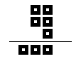
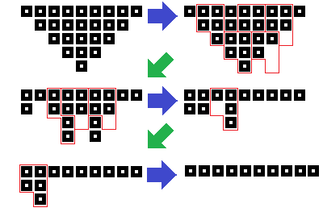
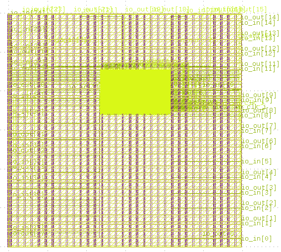

# 5-Bits Multiplier

Digital flow implementation using OpenLane for a custom 5-bit multiplier.

It works like the Wallace's or Dada's multiplier, using the long multiplication algorithm and uses a custom adder which works like this:

The addition tree is as follows:

It was presented as one of the exercises of the subject "Digital Systems II" in the first semester of 2022 at UIS, Santander, Colombia

## Final result in Klayout

